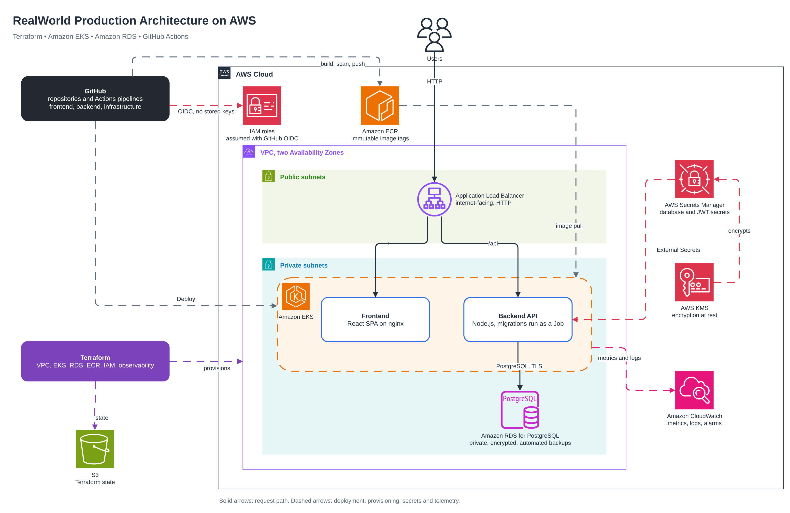

# RealWorld (Conduit) on AWS

Infrastructure and continuous delivery for the RealWorld "Conduit" application,
built for a full-stack DevOps/SRE take-home. The application is a React/Vite
frontend and an Express/PostgreSQL backend, each in its own repository. This
repository holds the Terraform that provisions AWS, the Kubernetes manifests
the application pipelines deploy, the architecture diagram and this
documentation.

## Contents

1. [Overview](#overview)
2. [Architecture](#architecture)
3. [Repositories](#repositories)
4. [Prerequisites](#prerequisites)
5. [Bootstrap](#bootstrap)
6. [GitHub configuration](#github-configuration)
7. [Deploying the infrastructure](#deploying-the-infrastructure)
8. [Seeding the application secret](#seeding-the-application-secret)
9. [Deploying the applications](#deploying-the-applications)
10. [Database](#database)
11. [Secrets](#secrets)
12. [Security](#security)
13. [Scalability and fault tolerance](#scalability-and-fault-tolerance)
14. [Observability](#observability)
15. [Backups and recovery](#backups-and-recovery)
16. [Local development](#local-development)
17. [Validation](#validation)
18. [Design decisions](#design-decisions)
19. [Known limitations](#known-limitations)
20. [Teardown](#teardown)
21. [Changes to the application repositories](#changes-to-the-application-repositories)

```
infrastructure/
├── architecture/          architecture.drawio (editable source), architecture.png
├── terraform/
│   ├── bootstrap/         state bucket, GitHub OIDC provider, Terraform role (local state)
│   ├── modules/           vpc, eks, rds, ecr, iam-github-oidc, iam-irsa, observability
│   └── environments/dev/  root module applied by the pipeline
├── kubernetes/
│   ├── base/              namespace, config, secrets wiring, deployments, services,
│   │                      ingress, HPA/PDB, NetworkPolicy, migration Job
│   ├── overlays/dev/      environment patches and image pins
│   └── render.sh          fills account-specific values from the live account
├── docker/                local stack: compose plus an nginx gateway mirroring the ingress
└── .github/workflows/     terraform.yml: validate, plan, apply
```

## Overview

What is deployed, and where:

- **AWS**, one region, one `dev` environment; every AWS resource is created by
  Terraform except the ALB, which the AWS Load Balancer Controller creates from
  the Kubernetes Ingress.
- **Amazon EKS** (Kubernetes 1.31) runs both applications on a managed node
  group in private subnets.
- **Amazon RDS for PostgreSQL** holds all application state, in private
  subnets, encrypted, with automated backups.
- **Amazon ECR** stores the images; tags are immutable.
- An internet-facing **Application Load Balancer**, created by the AWS Load
  Balancer Controller from a Kubernetes Ingress, serves both applications from
  one origin over HTTP.
- **GitHub Actions** builds, scans and deploys each application from its own
  repository, and plans and applies the Terraform from this one. Every job that
  talks to AWS authenticates with OpenID Connect; no AWS keys are stored in
  GitHub.
- **Amazon CloudWatch** collects metrics and logs through the CloudWatch
  Observability addon (Container Insights); Terraform defines alarms on the RDS
  and ALB service metrics.
- **AWS Secrets Manager** holds the database and JWT secrets; the **External
  Secrets Operator** projects them into a Kubernetes Secret.
- The frontend and backend are built and deployed **independently**: each
  pipeline rolls out only its own Deployment and Service, and the backend
  pipeline additionally reconciles the shared prerequisites (namespace,
  configuration, secrets wiring, ingress, network policies and both
  applications' HPAs and PDBs).

This is a working, deployed development environment sized for an assessment.
It is not presented as a production-hardened platform; the trade-offs are
listed under [Known limitations](#known-limitations).

## Architecture



Editable source: [architecture/architecture.drawio](architecture/architecture.drawio).

Request path:

```
Users
  -> internet-facing ALB (HTTP, public subnets, generated hostname)
       /            -> frontend Service -> nginx pods serving the React SPA
       /api, /images -> backend Service -> Node.js API pods
                                             -> Amazon RDS for PostgreSQL (private, TLS)
```

- The VPC spans two Availability Zones with a public and a private subnet in
  each. The ALB lives in the public subnets; the EKS worker nodes, all pods and
  the database live in the private subnets.
- Private subnets reach the internet through one NAT gateway (the `dev`
  default); an S3 gateway endpoint keeps ECR layer pulls off the NAT path.
- The database accepts connections only from the EKS cluster security group,
  never from a CIDR range, and is not publicly accessible.
- Both applications share one origin, so the browser makes no cross-origin API
  calls and the frontend image contains no environment-specific hostname.
- The ALB listens on HTTP port 80 only. There is no custom domain, ACM
  certificate or HTTPS listener (see Known limitations).

Around the request path: GitHub Actions assumes IAM roles through OIDC, pushes
images to ECR and applies manifests to EKS; Terraform provisions everything
and keeps the `dev` root's state in S3 (the bootstrap root's state is local);
Secrets Manager (encrypted with KMS) feeds the backend through External
Secrets; CloudWatch receives metrics and logs.

## Repositories

| Repository | Branch | Contents |
|---|---|---|
| https://github.com/rsyedops/realworld-infrastructure | `main` | Terraform, Kubernetes manifests, architecture diagram, this documentation, infrastructure workflow |
| https://github.com/rsyedops/express-postgresql-backend | `main` | Express/PostgreSQL API, Dockerfile (runtime and migrator), deploy workflow |
| https://github.com/rsyedops/react-vite-frontend | `master` | React/Vite SPA, Dockerfile (nginx), deploy workflow |

How they relate:

- Each application repository's deploy workflow checks out this repository at
  `main` (using the `INFRASTRUCTURE_TOKEN` secret, a fine-grained token with
  read-only Contents access to this repository) and applies the Kubernetes
  definitions from `kubernetes/overlays/dev`, pinned to the image it just
  pushed.
- The backend pipeline also applies the shared prerequisites (namespace,
  configuration, secrets wiring, network policies, ingress, autoscaling and
  disruption budgets). On a fresh environment deploy the backend first, then
  the frontend: the frontend pipeline needs the namespace and ingress that the
  backend's prerequisite phase creates.
- The infrastructure workflow only runs Terraform. It never applies the
  application manifests under `kubernetes/`; the only in-cluster objects it
  creates are the two Helm releases (AWS Load Balancer Controller and External
  Secrets).

## Prerequisites

- An AWS account and an IAM identity with permissions to create the bootstrap
  resources (S3, IAM, the OIDC provider). Configure it locally with the AWS CLI
  in whatever way your organisation uses; nothing in these repositories stores
  or expects AWS credentials.
- AWS CLI v2.
- Terraform >= 1.10 for the `dev` root (it uses S3 lockfile locking); the
  bootstrap root needs >= 1.9. CI pins 1.10.5.
- `kubectl`. The pipelines also need `kustomize`; GitHub-hosted runners ship
  it, and the workflows install 5.5.0 if it is missing.
- Docker with Compose, for the local stack only.
- GitHub CLI (`gh`), to look up the immutable numeric owner and repository IDs
  used in the OIDC trust policies.
- `openssl` (generating the JWT secret) and `envsubst` from gettext (used by
  `kubernetes/render.sh`).
- A GitHub account holding the three repositories.
- Optional, for local manifest validation: `kubeconform`.

## Bootstrap

`terraform/bootstrap` is applied once, locally, with your own credentials. It
creates the three things the pipeline cannot create for itself:

- the S3 bucket for Terraform state (versioned, SSE-S3 encrypted, public
  access blocked);
- the GitHub Actions OIDC identity provider (`create_oidc_provider = true`; set
  it to `false` to reuse one the account already has);
- the IAM role the infrastructure workflow assumes, trusted only for this
  repository's `dev` environment.

Bootstrap state is **local** (`terraform/bootstrap/terraform.tfstate`) and
gitignored, together with `terraform.tfvars`. Keep it until the environment
is torn down: it is the only record of the bucket, provider and role.

Inputs (`terraform/bootstrap/variables.tf`):

| Variable | Required | Meaning |
|---|---|---|
| `region` | yes | Region for the state bucket |
| `state_bucket_name` | yes | Globally unique bucket name |
| `infrastructure_repository` | yes | `owner/name` of this repository |
| `infrastructure_owner_id` | yes | Numeric GitHub ID of the owner |
| `infrastructure_repository_id` | yes | Numeric GitHub ID of this repository |
| `project` | no (`conduit`) | Prefix for the Terraform role name and its policy scoping; the bucket name is `state_bucket_name` as given |
| `deploy_environment` | no (`dev`) | GitHub Environment allowed to assume the role |
| `create_oidc_provider` | no (`true`) | Create the OIDC provider or look up the existing one |

The numeric IDs are immutable, unlike names, which is why the trust policies
use them. Look them up with the GitHub CLI:

```bash
gh api repos/<owner>/<repository> --jq '{owner_id: .owner.id, id: .id}'
```

Then:

```bash
cd terraform/bootstrap
cp terraform.tfvars.example terraform.tfvars   # fill in the values above
terraform init
terraform apply
terraform output
```

Map the outputs to GitHub repository variables on the infrastructure
repository:

| Output | Variable |
|---|---|
| `state_bucket` | `TF_STATE_BUCKET` |
| `terraform_role_arn` | `AWS_ROLE_ARN` |
| `oidc_provider_arn` | `GH_OIDC_PROVIDER_ARN` |

## GitHub configuration

All three repositories use a GitHub Environment named `dev`. The `dev`
environments currently have no protection rules; they exist because the OIDC
trust policies match on the environment claim. Add required reviewers or
branch restrictions before using this setup for anything beyond a development
environment.

**OIDC trust.** Both IAM roles (the Terraform role from bootstrap and the
application deploy role created by the `dev` root) trust the GitHub OIDC
provider with an exact match on the token subject
`repo:<owner>@<owner_id>/<name>@<repo_id>:environment:dev`. The subject pins
the repository by its immutable numeric IDs and the `dev` environment. It does
not pin a branch: any workflow in the repository whose job declares
`environment: dev` can assume the role, which is what environment protection
rules are for.

### Infrastructure repository

Repository variables:

| Variable | Value |
|---|---|
| `AWS_REGION` | `us-east-1` |
| `AWS_ROLE_ARN` | bootstrap output `terraform_role_arn` |
| `TF_STATE_BUCKET` | bootstrap output `state_bucket` |
| `GH_OIDC_PROVIDER_ARN` | bootstrap output `oidc_provider_arn` |
| `DEPLOY_REPOSITORIES` | HCL map of the application repositories, below |

`DEPLOY_REPOSITORIES` is passed verbatim to Terraform as
`TF_VAR_github_repositories`, so it must be an HCL map literal. Terraform
validates that the IDs are numeric:

```hcl
{
  backend = {
    owner    = "<owner>"
    owner_id = "<owner numeric id>"
    name     = "express-postgresql-backend"
    id       = "<repository numeric id>"
  }
  frontend = {
    owner    = "<owner>"
    owner_id = "<owner numeric id>"
    name     = "react-vite-frontend"
    id       = "<repository numeric id>"
  }
}
```

No secrets are needed on the infrastructure repository.

### Application repositories (backend and frontend)

Repository variables:

| Variable | Backend | Frontend |
|---|---|---|
| `AWS_REGION` | `us-east-1` | `us-east-1` |
| `AWS_ROLE_ARN` | `dev` root output `github_actions_role_arn` | same role |
| `ECR_REPOSITORY` | `conduit/backend` | `conduit/frontend` |
| `EKS_CLUSTER` | `conduit-dev` | `conduit-dev` |
| `KUBERNETES_NAMESPACE` | `conduit` | `conduit` |
| `INFRASTRUCTURE_REPOSITORY` | `rsyedops/realworld-infrastructure` | same |

The application deploy role is a different role from the Terraform role: it
can push to the two ECR repositories and reach the EKS API, and it is created
by the `dev` root, so its ARN is only known after the first infrastructure
apply (`terraform output github_actions_role_arn`).

Repository secret, on both application repositories:

| Secret | Value |
|---|---|
| `INFRASTRUCTURE_TOKEN` | A fine-grained personal access token scoped to the infrastructure repository only, with `Contents: read`. Used by `actions/checkout` to read the manifests. Never write the value anywhere but the GitHub secret. |

## Deploying the infrastructure

`.github/workflows/terraform.yml` runs on pull requests that touch
`terraform/**`, and on pushes to `main` that touch `terraform/**` or the
workflow file itself. Changes to the README, the diagram or the Kubernetes
manifests do not trigger it.

| Event | Jobs |
|---|---|
| pull request | `validate` (terraform fmt -check, terraform validate, tfsec on `environments/dev` and `bootstrap`) -> `plan` |
| push to `main` | `validate` -> `plan` -> `apply` (`-auto-approve`, then `terraform output`) |

The `plan` and `apply` jobs run in the `dev` environment, assume
`AWS_ROLE_ARN` through OIDC, use Terraform 1.10.5, and initialise the S3
backend from repository variables. State locking uses the S3 lockfile
(`use_lockfile = true`); there is no DynamoDB table.

The pipeline passes only `region`, `github_repositories` and
`github_oidc_provider_arn`. Every other input takes its default from
`terraform/environments/dev/variables.tf`, including the protective ones:

- `db_deletion_protection = true`
- `db_skip_final_snapshot = false`
- `ecr_force_delete = false`

`terraform/environments/dev/terraform.tfvars.example` documents the inputs
for a local apply; it is not consumed by CI.

One apply provisions the VPC, the EKS cluster and node group with the
`vpc-cni` (network policy enabled), `kube-proxy`, `coredns` and CloudWatch
Observability addons, the RDS instance, the ECR repositories, the IAM roles
(GitHub OIDC and IRSA), three customer-managed KMS keys, the Secrets Manager
secret container, the CloudWatch log groups, alarms and SNS topic, and two
Helm releases: the AWS Load Balancer Controller (chart 1.10.1) and External
Secrets (chart 0.10.7). A green run leaves the cluster ready for the
applications.

### Working with the dev root locally

Local `plan`, `output` and (for teardown) `destroy` need the same backend
configuration the pipeline uses:

```bash
cd terraform/environments/dev
terraform init \
  -backend-config="bucket=<state bucket>" \
  -backend-config="key=conduit/dev/terraform.tfstate" \
  -backend-config="region=<region>" \
  -backend-config="encrypt=true" \
  -backend-config="use_lockfile=true"
terraform plan   # supply the three inputs with -var or TF_VAR_* as CI does
```

Static validation without any backend or credentials:

```bash
terraform -chdir=terraform/environments/dev init -backend=false
terraform fmt -check -recursive terraform
terraform -chdir=terraform/environments/dev validate
```

### Cluster access

The cluster uses EKS access entries (`authentication_mode = API`). The
Terraform role that created the cluster and the application deploy role are
cluster administrators. To use `kubectl` yourself, add your IAM principal to
the `cluster_admins` map of the `dev` root and apply it locally with the
backend configuration above, then run the command in the `kubeconfig_command`
output. The pipeline does not pass this variable, so its next apply removes an
entry that exists only locally; to keep it, change the variable's default or
extend the workflow to pass `TF_VAR_cluster_admins`.

## Seeding the application secret

Terraform creates the Secrets Manager secret `conduit-dev/application` but
never writes a value into it, so no secret material passes through Terraform
state or plans. Seed the JWT signing key once, before the first backend
deployment. The value is generated locally, sent straight to Secrets Manager
and never committed or printed:

```bash
# from the repository root, after the dev root is initialised against the S3 backend
aws secretsmanager put-secret-value \
  --secret-id "$(terraform -chdir=terraform/environments/dev output -raw application_secret_name)" \
  --secret-string "{\"JWT_SECRET\":\"$(openssl rand -base64 48)\"}"
```

Do not retrieve the value afterwards; the backend reads it through External
Secrets. To rotate it, run the same command again, wait for the
ExternalSecret's hourly refresh (or force one with
`kubectl -n conduit annotate externalsecret backend-secrets force-sync=$(date +%s) --overwrite`),
then `kubectl -n conduit rollout restart deployment/backend`.

## Deploying the applications

Each application deploys on a push to its deployment branch: backend `main`;
frontend `master` (its workflow also lists `main`). Both workflows also accept
`workflow_dispatch`. Runs are serialised per branch and never cancelled
mid-deploy.

### Backend

`express-postgresql-backend/.github/workflows/deploy.yml`:

1. **verify**: `npm ci`, type check, ESLint, Prettier check, unit tests
   (vitest), `npm audit --omit=dev --audit-level=high`.
2. **build**: assume the deploy role, build the runtime image, scan it with
   Trivy (`HIGH,CRITICAL`, unfixed ignored, exit code 1) **before** pushing,
   push it as `sha-<first 12 characters of the commit>`, then build and push
   the migrator image as `<tag>-migrator`.
3. **deploy**: check out this repository, `aws eks update-kubeconfig`, run
   `kubernetes/render.sh`, pin both images in the overlay, then:
   - apply prerequisites: `kubectl apply --selector conduit/phase=prerequisites`;
   - `kubectl wait externalsecret/backend-secrets --for=condition=Ready`;
   - delete any previous `migrate` Job, apply
     `--selector app.kubernetes.io/name=migrate`, and poll the Job's
     `Complete`/`Failed` conditions every 10 s for up to 10 minutes. A failed
     Job prints its (redacted) logs and stops the release with the previous
     version still serving;
   - apply `--selector app.kubernetes.io/name=backend` (Service and Deployment);
   - `kubectl rollout status deployment/backend`;
   - smoke test: read the ALB hostname from the Ingress and expect HTTP 200
     from `/api/tags`, retrying for up to 10 minutes; on failure
     `kubectl rollout undo deployment/backend` and fail the run.

### Frontend

`react-vite-frontend/.github/workflows/deploy.yml`:

1. **verify**: `npm ci` on Node 16.20.2, ESLint, `npm run build` with
   `VITE_API_URL=/api`, `npm audit --omit=dev --audit-level=critical`. No
   tests run: the upstream project has no npm test script, only a single
   Cypress end-to-end spec that is not wired into CI.
2. **build**: build the nginx image with build argument `VITE_API_URL=/api`
   (the deployed SPA calls the API on its own origin), Trivy scan with the
   same gate as the backend, push as `sha-<12 characters>`.
3. **deploy**: check out this repository, render, pin the image, apply
   `--selector app.kubernetes.io/name=frontend` (Service and Deployment),
   `kubectl rollout status deployment/frontend`, then smoke test `/` for
   HTTP 200 with the same retry and automatic `rollout undo` on failure.

The frontend repository also keeps a `CI` workflow that runs the verify steps
on pull requests. The backend repository's upstream `CI` workflow still runs
on pushes to `main`; it is independent of the deploy workflow.

### Ownership of Kubernetes objects

The `dev` overlay renders 19 objects. Every object carries exactly one
ownership label, and each pipeline step applies only its own selector, so a
backend deploy can never alter the frontend Deployment or vice versa:

| Selector | Applied by | Objects |
|---|---|---|
| `conduit/phase=prerequisites` | backend, first | Namespace `conduit`, ServiceAccount `conduit-secrets`, ConfigMap `backend-config`, SecretStore `aws-secretsmanager`, ExternalSecret `backend-secrets`, NetworkPolicies `default-deny`, `migrate`, `backend`, `frontend`, Ingress `conduit`, HPAs `backend` and `frontend`, PDBs `backend` and `frontend` (14) |
| `app.kubernetes.io/name=migrate` | backend | Job `migrate` (1) |
| `app.kubernetes.io/name=backend` | backend | Service and Deployment `backend` (2) |
| `app.kubernetes.io/name=frontend` | frontend | Service and Deployment `frontend` (2) |

Applying the Ingress, HPAs, PDBs and NetworkPolicies before the Deployments
exist is safe: the objects are accepted and become effective as their targets
appear. With the controller's default `tolerate-non-existent-backend-service`
setting, the ALB is created at that point with fixed 503 responses for paths
whose Service does not exist yet, and the controller swaps in the real target
group as each Service is created. Image tags are immutable and derived from
the commit, so a tag can never be overwritten and a rollback is a re-deploy of
an earlier tag.

### Finding the URL

The hostname is generated by the load balancer and is not committed anywhere.
Read it from the "Smoke test" step of either deploy workflow (it prints
`API healthy at http://...` or the equivalent), or, with cluster access:

```bash
kubectl -n conduit get ingress conduit -o jsonpath='{.status.loadBalancer.ingress[0].hostname}'
```

The live URL for this submission is provided separately.

## Database

- Amazon RDS for PostgreSQL 16 (`db_engine_version`, currently 16.15),
  `db.t4g.micro`, gp3 storage 20 GiB with autoscaling up to 100 GiB.
  `auto_minor_version_upgrade` is on, so after RDS applies a minor upgrade in
  the maintenance window the pinned version must be bumped (or set to the
  major version `16`) before the next apply.
- Single-AZ in `dev` (`db_multi_az = false`). Multi-AZ is a one-variable
  change for production and is not enabled here.
- Private subnets, `publicly_accessible = false`, security group ingress on
  5432 only from the EKS cluster security group.
- A custom parameter group sets `rds.force_ssl = 1`, so the server refuses
  unencrypted connections, and logs slow statements (over 1 s), connections,
  disconnections and lock waits.
- The backend and the migrator connect with `sslmode=require` and verify the
  server certificate: the Amazon RDS global CA bundle is baked into both
  images and loaded through `NODE_EXTRA_CA_CERTS`.
- Storage, snapshots, Performance Insights and the RDS-managed master
  password secret are encrypted with a dedicated customer-managed KMS key.
- Automated backups: daily, 7-day retention, which is also the point-in-time
  recovery window (see Backups and recovery).
- Schema migrations (Drizzle SQL files in the backend repository) run as a
  Kubernetes Job from the migrator image before every backend rollout. The
  migration completes, or the release stops.

## Secrets

| Secret | Created by | Stored in |
|---|---|---|
| Database master credentials | RDS (`manage_master_user_password`) | Secrets Manager, rotated by RDS on its managed schedule |
| `JWT_SECRET` | the operator, once (see Seeding) | Secrets Manager secret `conduit-dev/application` |

Both secrets are encrypted with customer-managed KMS keys (the RDS key and a
dedicated application-secrets key), all with annual rotation enabled.

In the cluster, the External Secrets Operator reads them through a namespaced
`SecretStore` that authenticates with the `conduit-secrets` ServiceAccount
(IRSA). The IAM role behind that ServiceAccount may read exactly these two
secrets and decrypt only through Secrets Manager; the operator itself has no
AWS permissions. The `ExternalSecret` `backend-secrets` refreshes every hour
and renders a Kubernetes Secret of the same name with two keys:

- `DATABASE_URL`: `postgresql://<user>:<password>@<endpoint>:5432/<db>?sslmode=require`,
  with the password percent-encoded because a generated password can contain
  characters that would otherwise break the URL;
- `JWT_SECRET`.

The backend Deployment and the migration Job consume the Secret with
`envFrom`, alongside the non-secret settings in the `backend-config`
ConfigMap (`NODE_ENV`, `PORT`, `JWT_ISSUER`, `JWT_EXP`, `PUBLIC_URL`).
Because the values are environment variables, a rotated secret reaches a pod
only when the pod restarts (`kubectl -n conduit rollout restart deployment/backend`
after the hourly refresh has landed).

Terraform never handles a secret value. `kubernetes/render.sh` reads the
database endpoint and the master secret ARN back from the account and
substitutes them into the overlay, so nothing account-specific is committed.

## Security

Network and platform:

- Worker nodes, pods and the database are in private subnets; the ALB is the
  only public entry point to the workloads. Egress goes through NAT; ECR image
  layers go through an S3 gateway endpoint.
- The RDS security group has no CIDR ingress rule, only a reference to the
  cluster security group.
- Kubernetes NetworkPolicy, enforced by the VPC CNI (`enableNetworkPolicy`):
  `default-deny` for all pods in the namespace, then explicit allowances
  (backend: ingress on 3000, egress to DNS and 5432; frontend: ingress on
  8080, egress to DNS; migrate: egress to DNS and 5432).
- VPC flow logs capture rejected traffic to CloudWatch (30-day retention).
- The EKS API endpoint is private and public; the public CIDR list defaults
  to `0.0.0.0/0` (`eks_endpoint_public_access_cidrs`) and should be narrowed.
- Cluster access is managed with EKS access entries, not the `aws-auth`
  ConfigMap.

Workloads:

- The namespace carries Pod Security Admission labels (`enforce: baseline`,
  `audit`/`warn: restricted`).
- Every container runs as non-root, with a read-only root filesystem, all
  capabilities dropped, `allowPrivilegeEscalation: false` and the
  `RuntimeDefault` seccomp profile; writable paths are `emptyDir` volumes.
- The backend runtime image removes npm and upgrades the base packages; the
  frontend uses the unprivileged nginx image on port 8080.

Supply chain and identity:

- GitHub Actions authenticates with OIDC; no static AWS keys exist. Trust
  policies match the exact subject with immutable numeric owner and
  repository IDs and the `dev` environment.
- ECR tags are immutable and repositories scan on push. Trivy scans every
  runtime image for HIGH and CRITICAL fixable vulnerabilities before it is
  pushed, so a failing scan cannot publish.
- Three customer-managed KMS keys with rotation: Kubernetes Secrets in etcd,
  RDS (storage, snapshots, Performance Insights, master secret) and the
  application secret.
- IRSA roles are per workload (load balancer controller, External Secrets,
  CloudWatch agent); the node role carries only AWS-managed policies: the
  three EKS requires plus `AmazonSSMManagedInstanceCore` for Session Manager
  access.

Disclosed weak point: the application deploy role is granted
`AmazonEKSClusterAdminPolicy` at cluster scope so that one role can apply
every object the pipelines own. A namespace-scoped access policy (or a
separate role per repository) is the first hardening step for production.

## Scalability and fault tolerance

What is in place today:

- The VPC spans two Availability Zones; the ALB and the node group use both.
- One managed node group of `t3.large` on-demand instances, `min 2`,
  `desired 2`, `max 4`. Two nodes are running. These numbers are a capacity
  boundary, not automatic scaling: **no Cluster Autoscaler or Karpenter is
  deployed**. Terraform owns `min` and `max` but ignores `desired_size` after
  creation (the module is written for an autoscaler that is not installed), so
  the running node count is changed by raising `min_size` in Terraform or with
  `aws eks update-nodegroup-config`.
- Each application runs two replicas, held at that level by its
  HorizontalPodAutoscaler's `minReplicas: 2` (the Deployments intentionally
  declare no `replicas`). The HPAs are configured for CPU at 70 % (backend up
  to 10, frontend up to 6), **but no metrics-server is deployed, so CPU
  metrics are unavailable and the HPAs cannot currently scale above their
  minimum.** Installing metrics-server is the missing piece.
- PodDisruptionBudgets (`minAvailable: 1`) protect both applications during
  node drains, and node group updates allow at most 33 % of the nodes to be
  unavailable, which with two nodes means one at a time.
- Topology spread constraints (`maxSkew: 1`, `whenUnsatisfiable:
  ScheduleAnyway`) prefer to place replicas in different zones without
  blocking scheduling when that is impossible.
- Rolling updates with `maxUnavailable: 0` and `maxSurge: 1`; a `preStop`
  sleep lets the ALB withdraw an endpoint before the container is signalled,
  because the application installs no SIGTERM handler.
- Probes: backend liveness is a TCP check (the API has no health route and
  should not restart during a database outage), readiness is
  `GET /api/tags`, plus a startup probe; frontend liveness and readiness use
  `GET /healthz` served by nginx.
- The ALB health-checks both target groups on `/api/tags`; the SPA's
  catch-all answers it with the shell, so one path serves both.
- RDS is single-AZ in `dev` (RDS picks the zone) and the one NAT gateway sits
  in the first zone, so losing the database's zone interrupts the database and
  losing the NAT gateway's zone interrupts all private egress. Multi-AZ RDS
  and `nat_gateway_strategy = "per_az"` are the production settings.

## Observability

Everything runs on CloudWatch; there is no Prometheus or Grafana.

- **CloudWatch Observability addon** (Container Insights) on the cluster:
  pod, node and cluster metrics, plus container logs shipped to
  `/aws/containerinsights/conduit-dev/application` (created by Terraform
  with 30-day retention). The addon also creates `dataplane`, `host` and
  `performance` log groups on its own; those currently have no retention
  policy.
- **EKS control plane logs**: `api`, `audit`, `authenticator`,
  `controllerManager`, `scheduler`, in a pre-created log group with 30-day
  retention.
- **RDS**: Enhanced Monitoring at 60 s, Performance Insights (7-day
  retention), and the `postgresql` and `upgrade` log exports with 30-day
  retention, including the slow query, connection and lock-wait logging set
  in the parameter group.
- **VPC flow logs**: rejected traffic, 30-day retention.

Alarms (module `observability`) are wired to one SNS topic. The topic has no
subscription unless `alarm_email_subscriptions` is set, and each email
subscription must be confirmed manually. The topic is encrypted with the
AWS-managed `aws/sns` key, which CloudWatch alarms cannot publish through;
switch it to a customer-managed key that grants `cloudwatch.amazonaws.com`
before relying on notifications. Alarms live in `dev` today:

| Alarm | Metric (namespace `AWS/RDS`) | Condition |
|---|---|---|
| `conduit-dev-db-cpu` | `CPUUtilization` average | > 80 % for 3 x 5 min |
| `conduit-dev-db-free-storage` | `FreeStorageSpace` minimum | < 2 GiB |
| `conduit-dev-db-connections` | `DatabaseConnections` maximum | > 80 for 2 x 5 min |

Three further alarms on the ALB (`HTTPCode_Target_5XX_Count` > 10 per 5 min,
`TargetResponseTime` p90 > 1.5 s for 2 x 5 min, `HealthyHostCount` < 1 for
3 x 1 min) are defined but created only when
`ingress_load_balancer_arn_suffix` is supplied on a later apply (a local apply
with the pipeline's backend configuration, since the workflow passes only its
three inputs), because the ALB is created by the in-cluster controller after
Terraform has run. None of the alarms is built on Container Insights metrics.

## Backups and recovery

- RDS automated backups run daily in the `03:00-04:00` UTC window with 7-day
  retention (`db_backup_retention_days`), which is also the point-in-time
  recovery window. `copy_tags_to_snapshot` is on and
  `delete_automated_backups` is off, so automated backups are kept for the
  rest of their 7-day window after the instance is deleted.
- With the default `db_skip_final_snapshot = false`, destroying the instance
  takes a final snapshot named `conduit-dev-final-<timestamp>` (the timestamp
  is fixed at creation time); `db_deletion_protection = true` blocks an
  accidental destroy.
- Restores always create a new instance:

```bash
aws rds restore-db-instance-to-point-in-time \
  --source-db-instance-identifier conduit-dev \
  --target-db-instance-identifier conduit-dev-restore \
  --restore-time <timestamp> \
  --db-subnet-group-name conduit-dev-db \
  --db-parameter-group-name conduit-dev-pg16 \
  --vpc-security-group-ids <rds security group id> \
  --no-publicly-accessible
```

  Verify the restored data, then switch over. A restored instance carries no
  RDS-managed master secret, so enable one
  (`aws rds modify-db-instance --manage-master-user-password --master-user-secret-kms-key-id alias/conduit-dev-rds ...`),
  rename the original away and the restored instance to `conduit-dev` (the
  identifier `kubernetes/render.sh` resolves), re-run `render.sh`, apply the
  prerequisites and restart the backend, then reconcile Terraform state with
  `terraform import`. Keep the original until the restore is confirmed.
- Application state lives entirely in PostgreSQL; the pods hold nothing worth
  preserving.
- Terraform state: the bucket is versioned, so earlier state files can be
  recovered, encrypted with SSE-S3 and blocked from public access. It has no
  lifecycle rule, so old versions are kept until deleted, and it is created
  with `force_destroy = true` so that bootstrap can be destroyed cleanly.
- This is single-region, single-AZ recovery. There is no cross-region
  replication or disaster-recovery site.

## Local development

`docker/` runs the whole stack on one machine: Postgres, the migration
service (gated on a healthy database), the backend (gated on the migration
completing), the frontend, and an nginx `gateway` that applies the same `/`,
`/api` and `/images` routing as the ingress.

```bash
cd docker
cp .env.example .env        # fill in the two secrets
docker compose up --build -d
curl http://localhost:8080/api/tags
```

The compose file builds the images from `../../express-postgresql-backend`
and `../../react-vite-frontend`, so the three repositories must be cloned as
sibling directories. The images are the ones that ship, but the local stack
does not apply the Kubernetes runtime constraints (read-only root filesystem,
NetworkPolicy, resource limits), so it exercises the application rather than
the hardening.

For application-level development (`npm run dev`, tests, seeding, the
Postman collection) see the application repositories' READMEs.

## Validation

What has been validated, and how:

| Check | Where | Result |
|---|---|---|
| `terraform fmt -check`, `terraform validate` | infrastructure workflow `validate` job, and locally | clean |
| tfsec on `environments/dev` and `bootstrap` | infrastructure workflow `validate` job | clean |
| `kubectl kustomize kubernetes/overlays/dev` + `kubeconform -strict -ignore-missing-schemas` | local | 19 resources: 17 valid, 0 invalid, 0 errors, 2 skipped (External Secrets CRDs) |
| Backend: type check, ESLint, Prettier, vitest unit tests, `npm audit` (high) | backend deploy workflow `verify` | passing |
| Frontend: ESLint, Vite build, `npm audit` (critical) | frontend deploy workflow `verify` | passing (no npm test script upstream; its single Cypress spec is not run) |
| Trivy image scans (HIGH, CRITICAL, fixable) | both deploy workflows, before push | clean |
| `kubectl rollout status` for both Deployments | both deploy workflows | complete |
| Smoke tests through the ALB: `GET /` (frontend workflow), `GET /api/tags` (backend workflow) | each deploy workflow, its own path | HTTP 200 |
| User registration, login and authenticated use through the deployed UI | manual, in a browser against the ALB | working |

The registration and login check is a manual validation; there is no
automated end-to-end test in these pipelines. Local commands:

```bash
terraform fmt -check -recursive terraform
terraform -chdir=terraform/environments/dev init -backend=false
terraform -chdir=terraform/environments/dev validate
kubectl kustomize kubernetes/overlays/dev | kubeconform -strict -ignore-missing-schemas -summary
```

## Design decisions

**EKS with a managed node group.** The brief asks for Kubernetes; EKS keeps
the control plane, addons and node lifecycle managed, and access entries put
cluster access in Terraform instead of a hand-edited ConfigMap.

**Terraform modules per concern.** Seven modules composed by a thin `dev`
root. A second environment is a new directory with different variables, not a
copy of the modules. State is in S3 with the native lockfile, so there is no
DynamoDB table to run.

**GitHub OIDC everywhere.** No long-lived AWS credentials exist in GitHub.
Subjects pin immutable numeric IDs rather than names, so a renamed or
recreated repository cannot inherit the trust.

**RDS owns its password, Secrets Manager owns the JWT key, External Secrets
delivers both.** Terraform never sees a secret value, and the operator's IAM
role is bound to one ServiceAccount in the application namespace, so the
operator itself has no AWS permissions.

**CloudWatch rather than Prometheus.** Container Insights gives pod and node
metrics and container logs from one managed addon. The application exposes no
custom metrics, so a Prometheus stack would be something to run and upgrade
for signal that is already available; once the application exports its own
metrics, `kube-prometheus-stack` is the right next step.

**Migrations run as a Job before the rollout.** A failed migration stops the
release with the previous version still serving. Locally the same ordering is
enforced by compose service dependencies.

**Independent ownership, shared prerequisites.** Each application pipeline
applies only the objects labelled as its own, so the two teams can ship
without touching each other's Deployment. Everything shared (namespace,
configuration, secrets wiring, policies, ingress, autoscaling, disruption
budgets) is labelled `conduit/phase=prerequisites` and reconciled by the
backend pipeline's first apply step, which, with the one-time secret seed,
makes a fresh cluster reproducible from the repositories.

**Push-based deployment rather than GitOps.** Fewer moving parts and a
pipeline that reads end to end. Argo CD would add drift detection and
reconciliation and is the first change to make if this grew past one
environment.

**Immutable, commit-derived image tags.** `sha-<12 characters>` cannot be
overwritten in ECR, so what was scanned is what runs, and any of the 30 most
recent release tags (the lifecycle policy expires older ones) is a rollback
target.

**Probes that fit the application as it is.** The API has no health route, so
liveness is a TCP check that stays up during a database outage, and readiness
is the cheapest real query. The ALB health check shares `/api/tags` across
both target groups rather than adding a route to the application.

## Known limitations

Several of these are deliberate development-environment trade-offs; each
notes the production change.

- **HTTP only, generated hostname.** No custom domain, Route 53 record, ACM
  certificate or HTTPS listener. Production terminates TLS on the ALB with an
  ACM certificate and redirects HTTP.
- **RDS is single-AZ** (`db_multi_az = false`). Set it to `true` for a
  standby and automatic failover.
- **One NAT gateway.** Losing its zone removes egress for all private subnets;
  `nat_gateway_strategy = "per_az"` fixes that at higher cost.
- **HPA CPU scaling is not functional**: the HPAs exist and hold the minimum
  replica count, but metrics-server is not deployed. Install it (Helm or the
  EKS addon) to make the CPU targets effective.
- **No Cluster Autoscaler or Karpenter.** Node capacity is fixed at the
  Terraform values.
- **ALB alarms are not created by default**; they need
  `ingress_load_balancer_arn_suffix` on a second apply after the ALB exists.
- **The SNS alarm topic has no subscriber** until
  `alarm_email_subscriptions` is set and confirmed, and it is encrypted with
  the AWS-managed `aws/sns` key, which CloudWatch alarms cannot publish
  through; a customer-managed key is needed before notifications work.
- **Addon-created Container Insights log groups** (`dataplane`, `host`,
  `performance`) have no retention policy.
- **The application deploy role is cluster-admin** (see Security).
- **`dev` GitHub environments have no protection rules**, and the trust
  policies do not pin a branch, so environment protection is the control to
  add before production.
- **EKS public endpoint allows `0.0.0.0/0`**; narrow
  `eks_endpoint_public_access_cidrs` to operator networks.
- **The migrator image is pushed without its own Trivy scan** (only the
  runtime image is scanned), and `npm audit` runs against production
  dependencies only.
- **Frontend gate is lighter than the backend's**: `npm audit` at `critical`
  and no test step, because the upstream project has no npm test script (its
  single Cypress spec is not wired into CI).
- **Rotated secrets need a pod restart**; values are injected as environment
  variables.
- **EKS addon versions are not pinned**; EKS resolves the default for the
  cluster version at apply time.
- **Single environment.** Only `environments/dev` exists; the module reuse is
  designed for but not exercised.
- **Application-level issues intentionally left unfixed**, since the brief is
  about the delivery platform: `pg-pool` emits an unhandled `error` event when
  an idle connection is dropped (for example on an RDS restart) and the
  process exits, which the restart policy recovers in seconds; JWT expiry is
  written in milliseconds where the standard expects seconds, so tokens
  effectively never expire; CORS is configured without an allowlist, which is
  low impact behind a same-origin ingress; and the error handler logs whole
  driver errors, which can include query parameters.

## Teardown

Nothing here is automated; the pipeline has no destroy job. Order matters,
because the ALB is created by the in-cluster controller and Terraform does
not know about it.

1. **Delete the Ingress** so the Load Balancer Controller removes the ALB,
   target groups and the security groups it created; otherwise the VPC cannot
   be destroyed:
   ```bash
   kubectl -n conduit delete ingress conduit
   ```
2. **Lift the protective defaults** in the `dev` root:
   `db_deletion_protection = false`, `db_skip_final_snapshot = true` (or keep
   it `false` to retain a final snapshot), `ecr_force_delete = true` (or empty
   the repositories by hand). Apply that change first, with the same backend
   configuration as the pipeline, since deletion protection must be turned
   off before the instance can be deleted.
3. **Destroy the environment** from `terraform/environments/dev` with the same
   `-backend-config` values and the three inputs the pipeline passes:
   ```bash
   terraform destroy
   ```
4. **Expect these to remain** for a while, by design: the final RDS snapshot
   if you kept one; the `conduit-dev/application` secret for its 30-day
   recovery window; the three KMS keys in their 30-day deletion window; and
   the addon-created Container Insights log groups, which Terraform does not
   own and which can be deleted manually.
5. **Destroy bootstrap last**, from `terraform/bootstrap` with its local
   state, and only when the environment state is no longer needed: the bucket
   is created with `force_destroy = true`, so this deletes every state
   version. If the local bootstrap state was lost, import the bucket, role and
   provider before destroying, or remove them by hand.
6. Optionally remove the GitHub variables, secrets and `dev` environments from
   the three repositories.

## Changes to the application repositories

Both repositories were treated as read-only application code; the changes
below are the delivery additions and the minimum source edits needed to run
the applications behind this platform.

### Frontend (`react-vite-frontend`)

- `src/main.jsx`: the API base URL was a hard-coded literal pointing at the
  public demo API. It now reads `VITE_API_URL` and falls back to the original
  value.
- `index.html` and `public/main.css`: the Conduit stylesheet was loaded from a
  host that now returns 404, so the deployed site rendered unstyled. The
  stylesheet is vendored and served with the application.
- `Dockerfile`: multi-stage build on Node 16.20.2 (Vite 2 cannot load its
  configuration on Node 18 or newer) into an unprivileged nginx image, with
  the base packages upgraded.
- `docker/nginx.conf`: SPA fallback, asset caching and a `/healthz` route for
  the probes.
- `.dockerignore`.
- `.github/workflows/ci.yml` (pull requests) and `.github/workflows/deploy.yml`.

### Backend (`express-postgresql-backend`)

- `Dockerfile`: the single-stage development image became a multi-stage
  production build with a separate `migrator` target, the Amazon RDS global
  CA bundle validated at build time and trusted through `NODE_EXTRA_CA_CERTS`
  in both images, base packages upgraded and npm removed in the runtime image,
  and both images running as the `node` user.
- `.dockerignore`.
- `.github/workflows/deploy.yml`.
- `README.md`: the local development section now points at the compose stack
  in this repository.
- `docker-compose.yml`: removed; the stack lives in `infrastructure/docker`.
- `package.json` / `package-lock.json`: `drizzle-orm` raised to `^0.45.3` and
  `path-to-regexp` resolved to 8.4.2 so that `npm audit --audit-level=high`
  passes. No application source files were changed.
